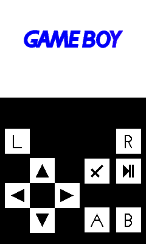

# YahGBAAsha
A port of the GBA emulator YahGBA by khaledev to Nokia Asha 311.
May work on other 240x400 resolution touch Java ME phones.
Same as the original this doesn't have any sound.
Doesn't include the bios so no builds.

FOR IT TO WORK DO THIS:
1. Obtain the bios.
2. Rename it bios.bin all in lowercase.
3. Put it in the src folder.

